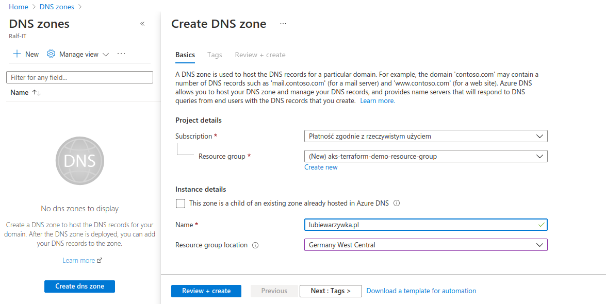
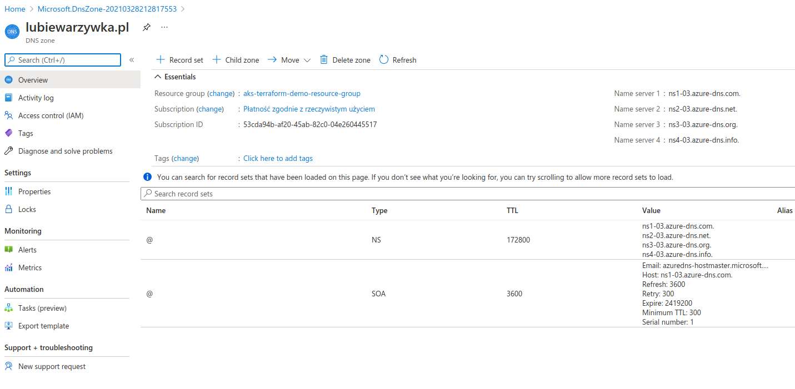
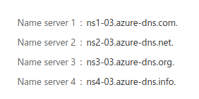
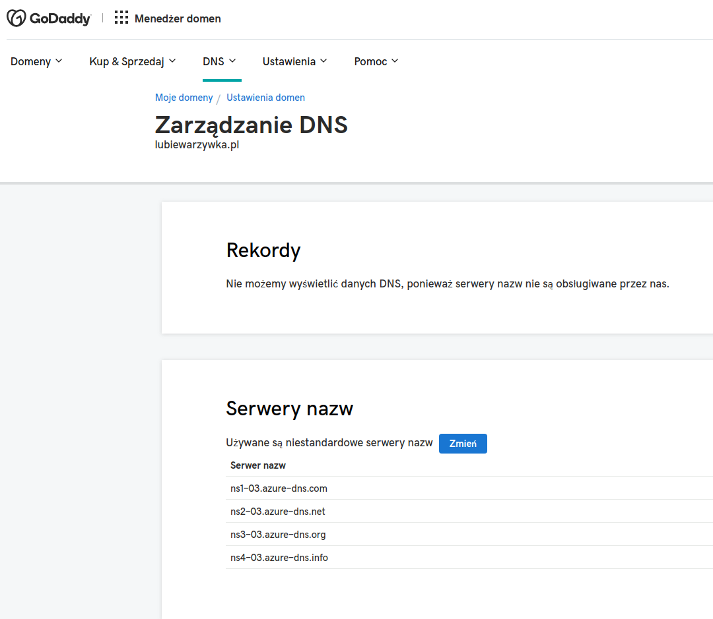

# Step 0 - Setup Custom Domain Name in Azure Portal









> NOTE: Make sure that name servers in Godaddy match those in Azure DNS Zone! Check that after redeployment. Name servers will change after recreating DNS Zone.


## Step 0.1 - Populate exports-private.sh

```sh
export AZURE_SUBSCRIPTION_ID="53cda94b-a...."
export AZURE_RESOURCE_GROUP=aks-resource-group-demo
export AZURE_CONTAINER_REGISTRY=containerregistry003
export AZURE_AKS_CLUSTER=aks-cluster-demo-000
export AZURE_AKS_DNS_PREFIX=aks-dns-demo-000
export AZURE_SERVICE_PRINCIPAL=azure-cli-2021-03-21-19-00-00
export AZURE_LOCATION="germanywestcentral"
export CUSTOM_DOMAIN="lubiewarzywka.pl"
export LETSENCRYPT_EMAIL="rob...@....."
export AZURE_ASK_NODES_ADMIN="demo"
```

## Step 2

```sh
bash 00-main.sh
```

After visit apps with curl

```
curl -k demo000.$CUSTOM_DOMAIN
curl -k demo001.$CUSTOM_DOMAIN
curl -k demo002.$CUSTOM_DOMAIN
```

# Notes

In local development build containers with

```sh
. exports-private.sh
az login
az account set --subscription $AZURE_SUBSCRIPTION_ID
az aks get-credentials --resource-group $AZURE_RESOURCE_GROUP --name $AZURE_AKS_CLUSTER
az acr login -n $AZURE_CONTAINER_REGISTRY.azurecr.io

# example build and push images to registry
docker build -t $AZURE_CONTAINER_REGISTRY.azurecr.io/<some-image>:dev .
docker push $AZURE_CONTAINER_REGISTRY.azurecr.io/<some-image>
```